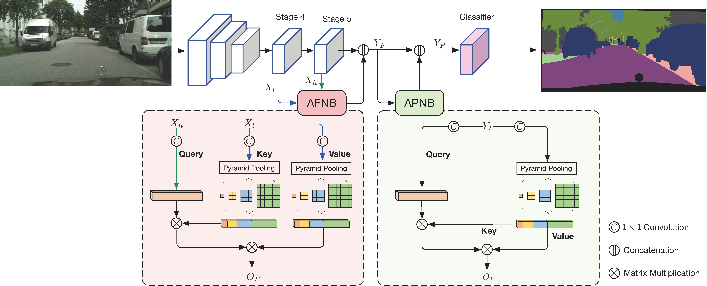
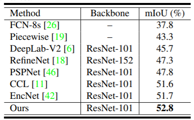

# ANN

This repository is for Asymmetric Non-local Neural Networks for Semantic Segmentation (to appear in ICCV 2019),

by [Zhen Zhu](https://zzhu.vision), [Mengde Xu](https://github.com/MendelXu), [Song Bai](http://songbai.site), [Tengteng Huang](https://github.com/tengteng95) and [Xiang Bai](https://scholar.google.com/citations?hl=en&user=UeltiQ4AAAAJ).

The source code is in preparing. We will release as soon as possible.

### citation
If you find our paper useful in your research, please consider citing:

	@inproceedings{li19,
	    author={Zhen Zhu, Mengde Xu, Song Bai, Tengteng Huang, Xiang Bai},
	    title={Asymmetric Non-local Neural Networks for Semantic Segmentation},
	    booktitle={International Conference on Computer Vision},   
	    year={2019},   
	}

### Table of contents
- [Introduction](#introduction)
- [Usage](#usage)
- [Results](#results)
- [Acknowledgement](#acknowledgement)

## Introduction

Fig.1 Model Architecture

In this work, we present Asymmetric Non-local Neural Network to semantic segmentation for acquiring long range dependency efficiently and effectively. The whole network is shown in [Fig. 1](#model). It can fuse features between different level under a sufficient consideration of inter long range dependencies  with AFNB and refine features in the same level involving the inner long range  dependencies with APNB.

## Usage

- Preparation

- Train

- Test

- Evaluation

- Efficiency Statistics

## Results
Tab.1 Comparisons on the validation set of PASCAL Context with the state-of-the-art methods.

  
  

## Acknowledgement
  We genuinely thank [Ansheng You](https://github.com/donnyyou) for his kind help and suggestions throughout our work. We also recommend others to implement computer vision algorithm with his framework [torchcv](<https://github.com/donnyyou/torchcv>).

  

  
